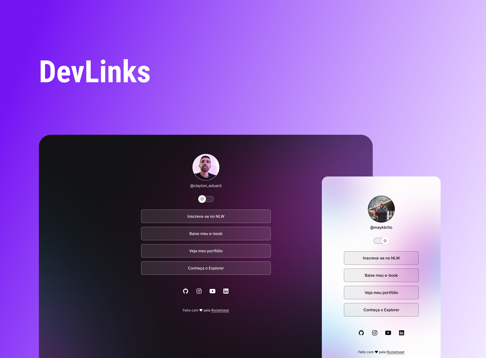

# [DevLinks ](https://github.com/ClaytonEduard/projeto-rocket)

Evento exclusivo e gratuito, promovido pela Rocketseat para ensino de tecnologias WEB.

[Tecnologias](https://github.com/ClaytonEduard/projeto-rocket#-tecnologias) | [Projeto](https://github.com/ClaytonEduard/projeto-rocket#-projeto) | [Layout](https://github.com/ClaytonEduard/projeto-rocket#-layout) | [Licença](https://github.com/ClaytonEduard/projeto-rocket#memo-licen%C3%A7a)

  

## [🚀 Tecnologias](https://github.com/ClaytonEduard/projeto-rocket#-tecnologias)

Esse projeto foi desenvolvido com as seguintes tecnologias:

- HTML e CSS
- JavaScript
- Git e Github
- Figma

## [💻 Projeto](https://github.com/ClaytonEduard/projeto-rocket#-projeto)

O DevLinks é um agregador de links para usar como cartão de visitas online.

## [🔖 Layout](https://github.com/ClaytonEduard/projeto-rocket)

Você pode visualizar o layout do projeto através [DESSE LINK](<https://www.figma.com/file/06UOCf4GdSNCQo98Am4F4w/DevLinks-%E2%80%A2-Projeto-Discover-(Community)?type=design&t=yPjH2RP6CoBFonHN-6>). É necessário ter conta no [Figma](https://figma.com/) para acessá-lo.

## [📝 Licença](https://github.com/ClaytonEduard/projeto-rocket#memo-licen%C3%A7a)

Esse projeto está sob a licença MIT.

---

Feito com ♥ by Rocketseat 👋 [Participe da nossa comunidade!](https://discord.gg/rocketseat)
